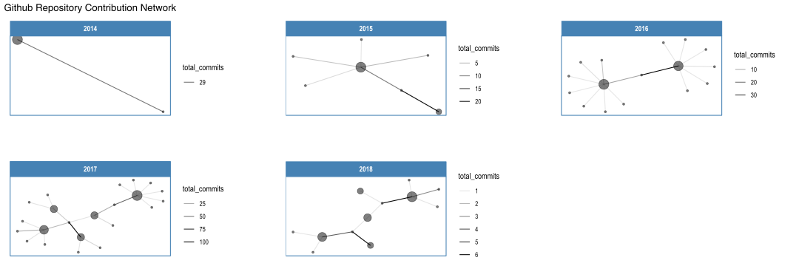
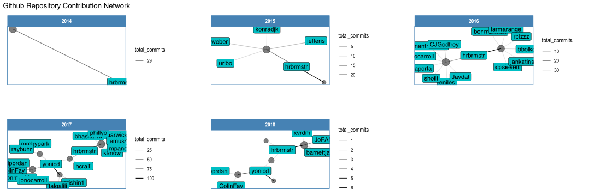
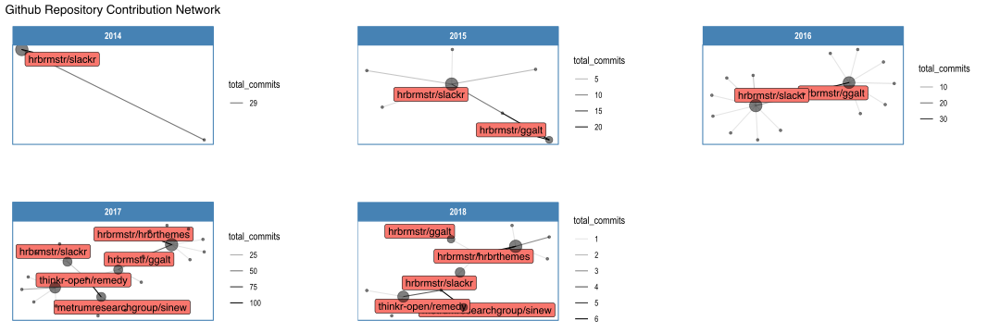
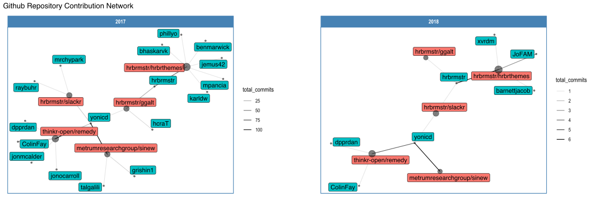

<!-- README.md is generated from README.Rmd. Please edit that file -->

# ghnet

Tidied Github commit data + ggraph network plots

## Installation

``` r

remotes::install_github('yonicd/ghnet')
```

## Examples

``` r
library(ghnet,warn.conflicts = FALSE,quietly = TRUE)
```

### Fetch Commit Data

``` r

ghnet::get_commit(user = 'thinkr-open',repo = 'remedy')
#> # A tibble: 13 x 7
#>             w     a     d     c user        date       repo  
#>         <dbl> <dbl> <dbl> <dbl> <chr>       <date>     <chr> 
#>  1 1524355200   523   470     4 yonicd      2018-04-22 remedy
#>  2 1517097600     2     0     1 dpprdan     2018-01-28 remedy
#>  3 1515888000    45    45     1 ColinFay    2018-01-14 remedy
#>  4 1513468800   159     1     1 jonocarroll 2017-12-17 remedy
#>  5 1512259200   145    17     3 yonicd      2017-12-03 remedy
#>  6 1511654400   105     8     2 yonicd      2017-11-26 remedy
#>  7 1511049600    86    18     4 ColinFay    2017-11-19 remedy
#>  8 1511049600   781   353    16 yonicd      2017-11-19 remedy
#>  9 1505606400   194    71     7 ColinFay    2017-09-17 remedy
#> 10 1505001600    19    50     3 ColinFay    2017-09-10 remedy
#> 11 1505001600   195    90     3 jonmcalder  2017-09-10 remedy
#> 12 1504396800   896    95    12 ColinFay    2017-09-03 remedy
#> 13 1504396800     1     1     1 dpprdan     2017-09-03 remedy
```

### Network Plots

``` r
gh_data%>%
  gh_plots(title = 'Github Repository Contribution Network')
```

<!-- -->

``` r

gh_data%>%
  gh_plots(title = 'Github Repository Contribution Network',
           add_labels='user')
```

<!-- -->

``` r

gh_data%>%
  gh_plots(title = 'Github Repository Contribution Network',
           add_labels='repo')
```

<!-- -->

``` r

gh_data%>%
  dplyr::filter(date>=as.Date('2017-01-01'))%>%
  gh_plots(title = 'Github Repository Contribution Network',
           add_labels='both')
```

<!-- -->

### ropenscilabs

``` r
ropenscilabs%>%
  ghnet::gh_plots(add_labels = 'repo',
                  title = 'ropensci labs contributions network',ncol=2)
```

<!-- -->

``` r

ropenscilabs%>%
  dplyr::filter(date>=as.Date('2018-01-01'))%>%
  ghnet::gh_plots(add_labels = 'both',
                  title = 'ropensci labs contributions network')
```

<!-- -->
