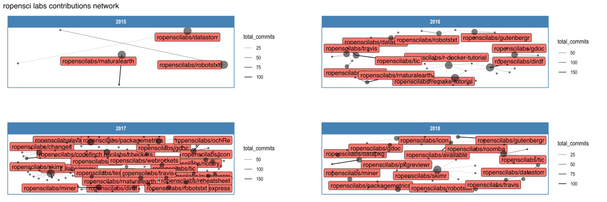

<!-- README.md is generated from README.Rmd. Please edit that file -->

# ghnet

Tidied Github commit data + ggraph network plots

## Installation

``` r

remotes::install_github('yonicd/ghnet')
```

## Examples

``` r
library(ghnet,warn.conflicts = FALSE,quietly = TRUE)
```

### Fetch Commit Data

Work with the nibble using tidyverse just like a `data_frame`

``` r
repos <- c(
'thinkr-open/remedy',
'hrbrmstr/slackr',
'hrbrmstr/ggalt',
'hrbrmstr/hrbrthemes',
'metrumresearchgroup/sinew')


#single
gh_data <- repos[1]%>%
  gh_commit_data()

#multiple
gh_data <- repos%>%
  purrr::map_df(gh_commit_data)
```

``` r
gh_data
#> # A tibble: 130 x 7
#>             w     a     d     c user        date       repo              
#>         <dbl> <dbl> <dbl> <dbl> <chr>       <date>     <chr>             
#>  1 1524355200   523   470     4 yonicd      2018-04-22 thinkr-open/remedy
#>  2 1517097600     2     0     1 dpprdan     2018-01-28 thinkr-open/remedy
#>  3 1515888000    45    45     1 ColinFay    2018-01-14 thinkr-open/remedy
#>  4 1513468800   159     1     1 jonocarroll 2017-12-17 thinkr-open/remedy
#>  5 1512259200   145    17     3 yonicd      2017-12-03 thinkr-open/remedy
#>  6 1511654400   105     8     2 yonicd      2017-11-26 thinkr-open/remedy
#>  7 1511049600    86    18     4 ColinFay    2017-11-19 thinkr-open/remedy
#>  8 1511049600   781   353    16 yonicd      2017-11-19 thinkr-open/remedy
#>  9 1505606400   194    71     7 ColinFay    2017-09-17 thinkr-open/remedy
#> 10 1505001600    19    50     3 ColinFay    2017-09-10 thinkr-open/remedy
#> # ... with 120 more rows
```

### Network Plots

``` r
gh_data%>%
  gh_plots(title = 'Github Repository Contribution Network')
```

<!-- -->

``` r

gh_data%>%
  gh_plots(title = 'Github Repository Contribution Network',
           add_labels='user')
#> Warning: Removed 1 rows containing missing values (geom_label).
#> Warning: Removed 2 rows containing missing values (geom_label).

#> Warning: Removed 2 rows containing missing values (geom_label).
#> Warning: Removed 5 rows containing missing values (geom_label).

#> Warning: Removed 5 rows containing missing values (geom_label).
```

<!-- -->

``` r

gh_data%>%
  gh_plots(title = 'Github Repository Contribution Network',
           add_labels='repo')
#> Warning: Removed 1 rows containing missing values (geom_label_repel).
#> Warning: Removed 5 rows containing missing values (geom_label_repel).
#> Warning: Removed 14 rows containing missing values (geom_label_repel).
#> Warning: Removed 17 rows containing missing values (geom_label_repel).
#> Warning: Removed 7 rows containing missing values (geom_label_repel).
```

<!-- -->

``` r

gh_data%>%
  dplyr::filter(date>=as.Date('2017-01-01'))%>%
  gh_plots(title = 'Github Repository Contribution Network',
           add_labels='both')
```

<!-- -->
